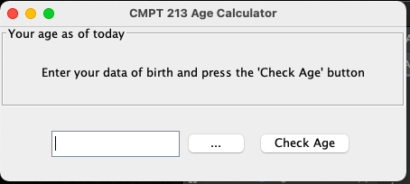
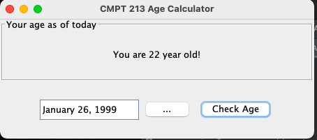
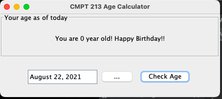
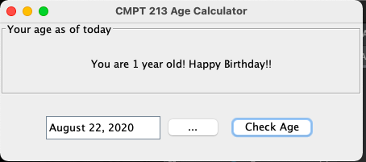

# Age Calculator

- A Java application calculate the user's age when the user enters their date of birth and presses the "Check Age" button.

- Date input is from [LGoodDatePicker](https://github.com/LGoodDatePicker/LGoodDatePicker)

## Main Menu

## Get Date

## Birthday

## Demo

